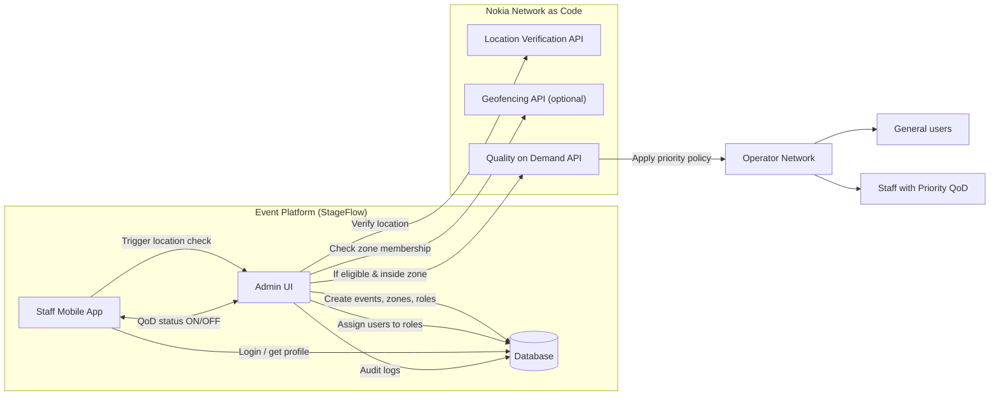
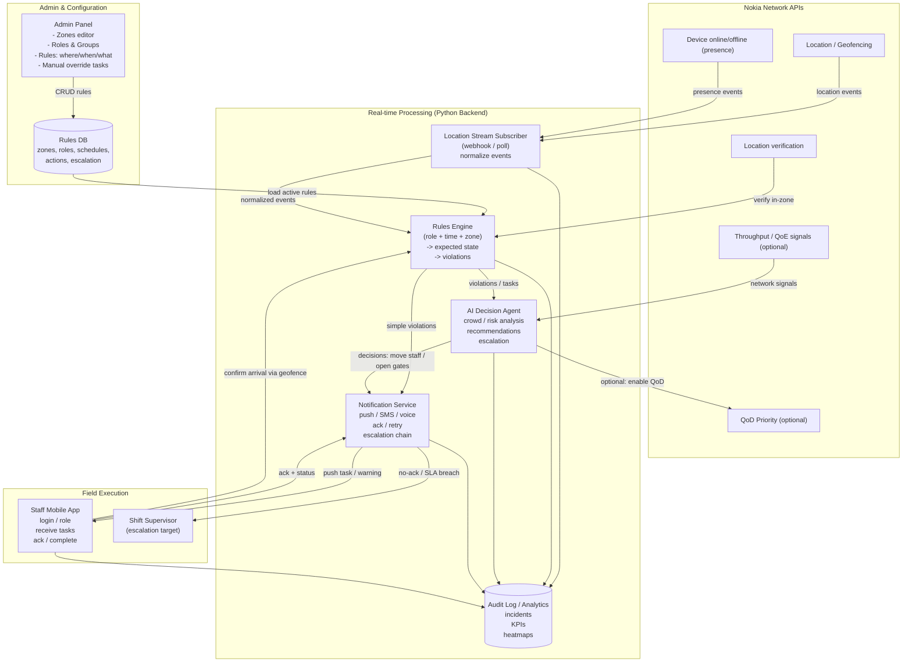

## Architecture Flow Step 1

1. ** If the user is eligible and inside a designated zone, the Quality on Demand (QoD) API applies a priority policy on the Operator Network, impacting the network interaction for both staff and general users.

## Architecture Flow Step 2
1. ** Staff control

