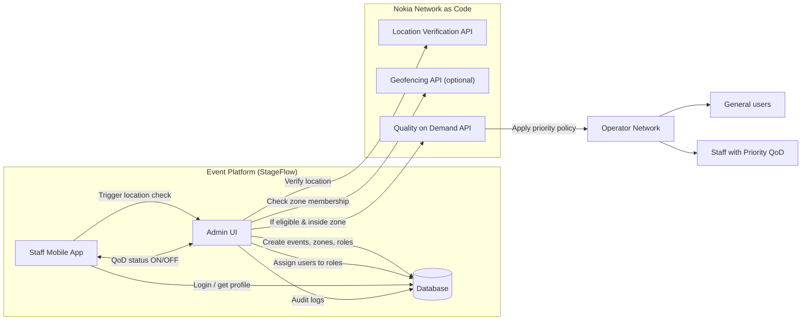

## Architecture Flow

```mermaid
flowchart LR

    %% ===== External Platform =====
    subgraph EA["Event Platform (StageFlow)"]
        Admin["Admin UI"]
        DB[(Database)]
        StaffApp["Staff Mobile App"]
    end

    %% ===== Nokia Network as Code =====
    subgraph Nokia["Nokia Network as Code"]
        Loc["Location Verification API"]
        Geo["Geofencing API (optional)"]
        QoD["Quality on Demand API"]
    end

    %% ===== Admin setup =====
    Admin -->|Create events, zones, roles| DB
    Admin -->|Assign users to roles| DB

    %% ===== Staff login =====
    StaffApp -->|Login / get profile| DB
    StaffApp -->|Trigger location check| Admin

    %% ===== Location verification =====
    Admin -->|Verify location| Loc
    Admin -->|Check zone membership| Geo

    %% ===== QoD activation =====
    Admin -->|If eligible & inside zone| QoD
    QoD -->|Apply priority policy| Telco["Operator Network"]

    %% ===== Network impact =====
    Telco --> Crowd["General users"]
    Telco --> Staff["Staff with Priority QoD"]

    %% ===== Monitoring =====
    Admin -->|Audit logs| DB
    StaffApp <-->|QoD status ON/OFF| Admin
```